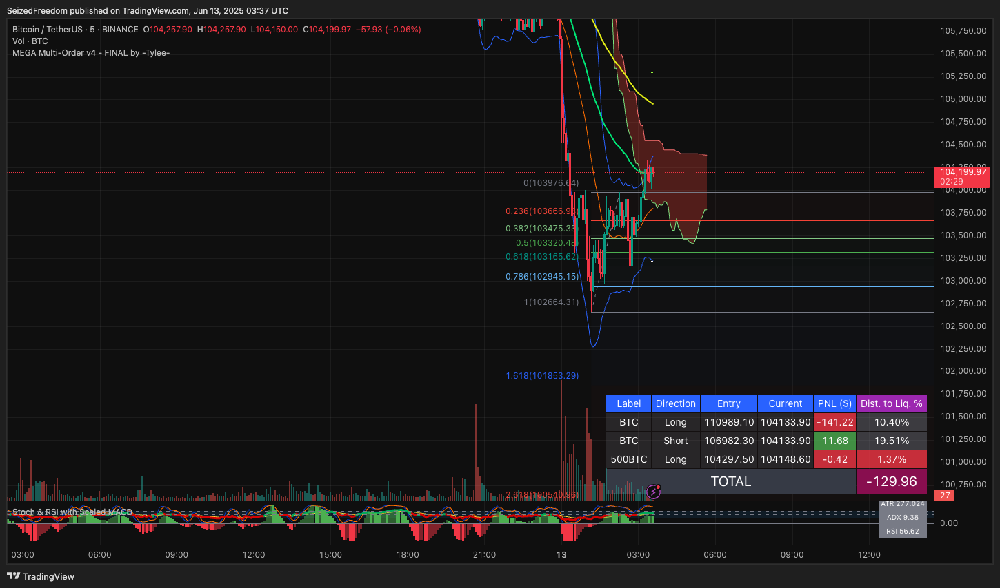
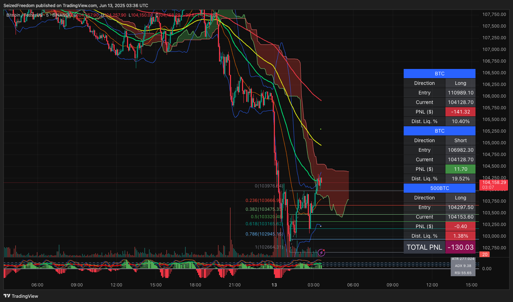
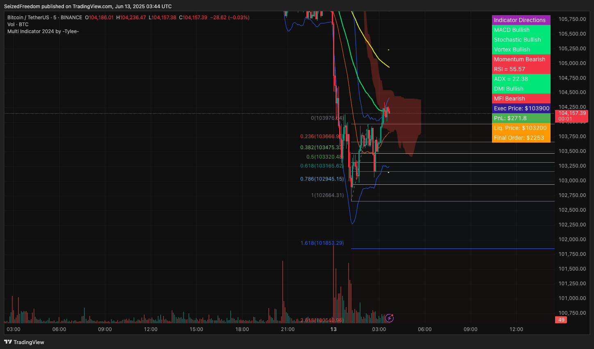
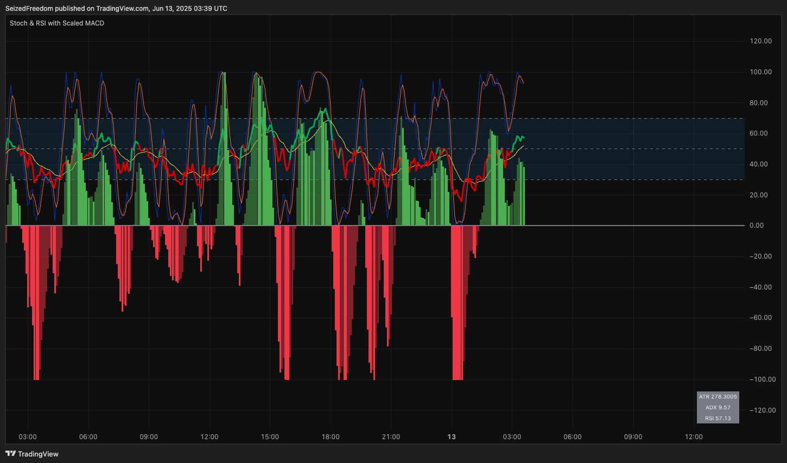

# MEGA Indicator Suite for TradingView by -Tylee-

This repository contains a powerful, all-in-one suite of Pine Script indicators for TradingView, authored by **-Tylee-**. These scripts are designed to work together to provide a complete analysis and trade management dashboard.

The suite consists of two parts:
1.  **Main Chart Overlays:** A selection of comprehensive indicators that run on your main price chart. They all share the same core visual analysis tools but differ in their position tracking capabilities.
2.  **A Companion Oscillator:** A feature-rich momentum indicator that runs in the panel below your main chart, combining Stochastic, RSI, and a uniquely scaled MACD histogram.

---

## Part 1: The Main Chart Overlays

There are three versions of the main overlay indicator. All three include the same powerful set of on-chart visual tools: **Bollinger Bands, Ichimoku Cloud, Triple Moving Averages (with crosses), and Auto Fibonacci Levels.**

They differ primarily in how they track and display your PNL.

### The Three Overlay Versions

1.  **`MEGA Multi-Order v4 - FINAL.txt` (Recommended Multi-Trade Tracker)**
    *   The most advanced version for tracking **up to 6 trades simultaneously**.
    *   Features a dedicated PNL table with a **switchable layout (Horizontal or Vertical)** to suit your preference.

2.  **`MEGA Multi Indicator 25.txt` (Legacy Multi-Trade Tracker)**
    *   A slightly older version of the multi-trade tracker. It also tracks **up to 6 trades**.
    *   Functionally identical to v4, but its PNL table is fixed to a **Horizontal layout only**.

3.  **`Multi Indicator 2024.txt` (Simplified Single-Trade Tracker)**
    *   A streamlined version designed for tracking just **one position at a time**.
    *   It merges the PNL information directly into the **Indicator Directions table**, creating a single, compact info panel.

### Overlay Feature Comparison

| Feature                 | `MEGA Multi-Order v4`      | `MEGA Multi Indicator 25` | `Multi Indicator 2024`         |
| ----------------------- | -------------------------- | ------------------------- | ------------------------------ |
| Visual Indicators       | ✅ Full Suite              | ✅ Full Suite             | ✅ Full Suite                  |
| PNL Tracker Type        | Multi-Order                | Multi-Order               | **Single-Order**               |
| Max Positions           | 6                          | 6                         | **1**                          |
| PNL Display             | **Separate Table**         | **Separate Table**        | **Integrated into Info Table** |
| PNL Table Layout        | **Horizontal & Vertical**  | Horizontal Only           | N/A (Integrated)               |
| Indicator Directions    | ✅ Yes                     | ✅ Yes                    | ✅ Yes (in shared table)         |

### Layout Examples

**Multi-Order Horizontal Layout** (`v4` and `25`)

**Multi-Order Vertical Layout** (`v4` only)

**Single-Order Integrated Layout** (`2024` only)

---

## Part 2: The Companion Oscillator

The file `Stochastic & RSI Combo with Scaled MACD....txt` is designed to be loaded as a separate indicator below your main chart. It provides a deeper look at momentum.

### Key Features
*   **Combined Oscillators:** Visualizes Stochastic RSI (K and D lines) and a standard RSI line on the same 0-100 scale.
*   **Scaled MACD Histogram:** A clever MACD histogram that is mathematically scaled to fit within the RSI's 0-100 range. This allows you to gauge MACD momentum without needing a separate axis.
*   **Momentum-Sensing Bars:** The MACD histogram bars are **solid** when momentum is decreasing and **hollow** when momentum is increasing, giving you an at-a-glance view of momentum shifts.
*   **Quick Info Panel:** A small, non-intrusive table on the indicator displays the current ATR, ADX, and RSI values for quick reference.

---

## How to Install and Use

1.  **Open TradingView:** Navigate to any chart on [TradingView](https://www.tradingview.com).
2.  **Open Pine Editor:** Click on the "Pine Editor" tab at the bottom of the screen.
3.  **Add the Indicators:**
    *   **For the main overlay:** Choose **one** of the three overlay scripts (`MEGA Multi-Order v4`, `MEGA Multi Indicator 25`, or `Multi Indicator 2024`). Copy its code, paste it into the Pine Editor, and click **"Add to chart"**.
    *   **For the companion oscillator:** In the Pine Editor, click "Open" -> "New indicator". Copy the code from `Stochastic & RSI Combo....txt`, paste it, and click **"Add to chart"**.
4.  **Configure:** Click the gear icon (⚙️) on each indicator to configure its settings. For the overlays, this is where you will input your trade(s) for the PNL tracker.

## Credits

*   **Original Author:** All credit for the creation, logic, and implementation of these fantastic indicators goes to **-Tylee-**.
*   **Libraries:** The overlay scripts utilize the `ZigZag` library by `TradingView/ZigZag/7` for their Auto Fibonacci functionality.
