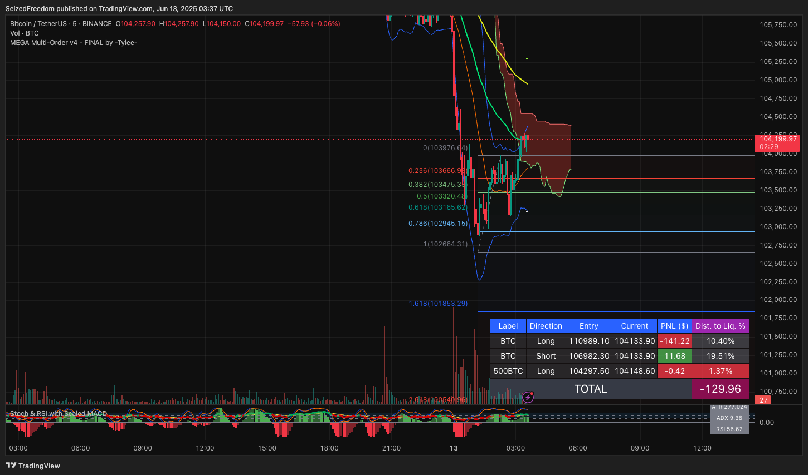
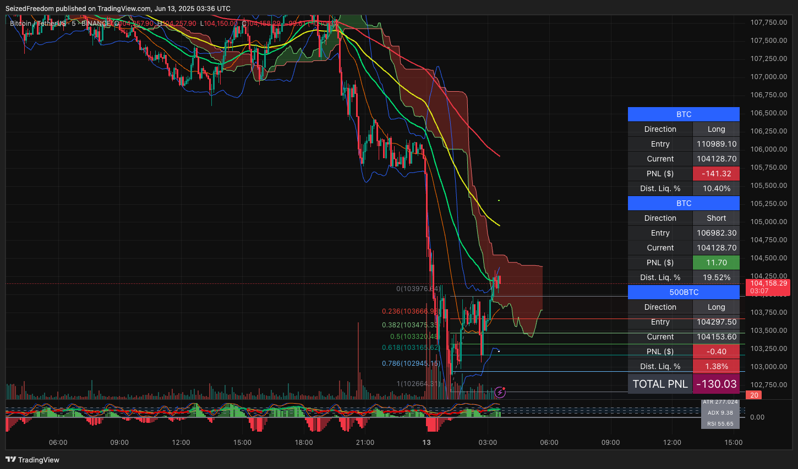

# MEGA Indicator Suite for TradingView by -Tylee-

This repository contains a powerful, all-in-one suite of Pine Script indicators for TradingView, authored by **-Tylee-**. These scripts are designed to work together to provide a complete analysis and trade management dashboard.

The suite consists of two parts:
1.  **A Main Chart Overlay:** A comprehensive indicator that runs on your main price chart, featuring a unique PNL tracker, multiple MAs, Bollinger Bands, Ichimoku Clouds, and Auto Fibonacci levels. (Two versions are provided).
2.  **A Companion Oscillator:** A feature-rich momentum indicator that runs in the panel below your main chart, combining Stochastic, RSI, and a uniquely scaled MACD histogram.

---

## Part 1: The Main Chart Overlay & PNL Tracker

This is the core of the suite, an overlay script that packs multiple tools into one. It comes in two versions, with the primary difference being a display option for the PNL tracker.

### Core Features (Both Versions)
*   **Manual PNL Tracker:** Manually track up to 6 positions across any symbol, with real-time PNL, distance-to-liquidation, and a total PNL summary.
*   **On-Chart Visuals:**
    *   Bollinger Bands (BB)
    *   Ichimoku Cloud
    *   Triple Moving Averages (with Golden/Death Cross signals)
    *   Auto Fibonacci Retracement Levels
*   **Indicator Directions Table:** A dashboard showing the current sentiment of the Vortex, Momentum, DMI, and MFI indicators.

### Version Comparison

| Feature / Aspect                   | `MEGA Multi Indicator 25`                               | `MEGA Multi-Order v4 - FINAL`                            |
| ---------------------------------- | ------------------------------------------------------- | -------------------------------------------------------- |
| **Core Indicator Calculations**    | ✅ Identical                                            | ✅ Identical                                             |
| **PNL Tracker Functionality**      | ✅ Yes                                                  | ✅ Yes                                                   |
| **PNL Tracker Layout**             |  Horizontal (Fixed)                                     | **✅ Horizontal & Vertical (User's Choice)**             |
| **Code Base**                      | Original Version                                        | Refined, with logic for switchable table layouts         |

### PNL Table Layouts

1.  **Horizontal Layout** (Available in both versions)
    *   Displays each position as a row with data spread across columns. Ideal for wider monitors.

    

2.  **Vertical Layout** (Available in `MEGA Multi-Order v4 - FINAL` only)
    *   A compact layout that stacks data vertically for each position, saving valuable chart space.

    

---

## Part 2: The Companion Oscillator

The file `Stochastic & RSI Combo with Scaled MACD Histogram with Momentum.txt` is designed to be loaded as a separate indicator below your main chart. It provides a deeper look at momentum.

### Key Features
*   **Combined Oscillators:** Visualizes Stochastic RSI (K and D lines) and a standard RSI line on the same 0-100 scale.
*   **Scaled MACD Histogram:** A clever MACD histogram that is mathematically scaled to fit within the RSI's 0-100 range. This allows you to gauge MACD momentum without needing a separate axis.
*   **Momentum-Sensing Bars:** The MACD histogram bars are **solid** when momentum is decreasing and **hollow** when momentum is increasing, giving you an at-a-glance view of momentum shifts.
*   **Quick Info Panel:** A small, non-intrusive table on the indicator displays the current ATR, ADX, and RSI values for quick reference.

---

## How to Install and Use

1.  **Open TradingView:** Navigate to any chart on [TradingView](https://www.tradingview.com).
2.  **Open Pine Editor:** Click on the "Pine Editor" tab at the bottom of the screen.
3.  **Add the Indicators:**
    *   To add the main overlay, copy the code from either `MEGA Multi Indicator 25.txt` or `MEGA Multi-Order v4 - FINAL.txt` and paste it into the Pine Editor. Click **"Add to chart"**.
    *   To add the companion oscillator, click "Open" -> "New indicator" in the Pine Editor. Copy the code from `Stochastic & RSI Combo....txt`, paste it, and click **"Add to chart"**.
4.  **Configure:** Click the gear icon (⚙️) on each indicator to configure its settings to your preference. For the overlay, this is where you will input your trades for the PNL tracker.

## Credits

*   **Original Author:** All credit for the creation, logic, and implementation of these fantastic indicators goes to **-Tylee-**.
*   **Libraries:** The overlay script utilizes the `ZigZag` library by `TradingView/ZigZag/7` for its Auto Fibonacci functionality.
