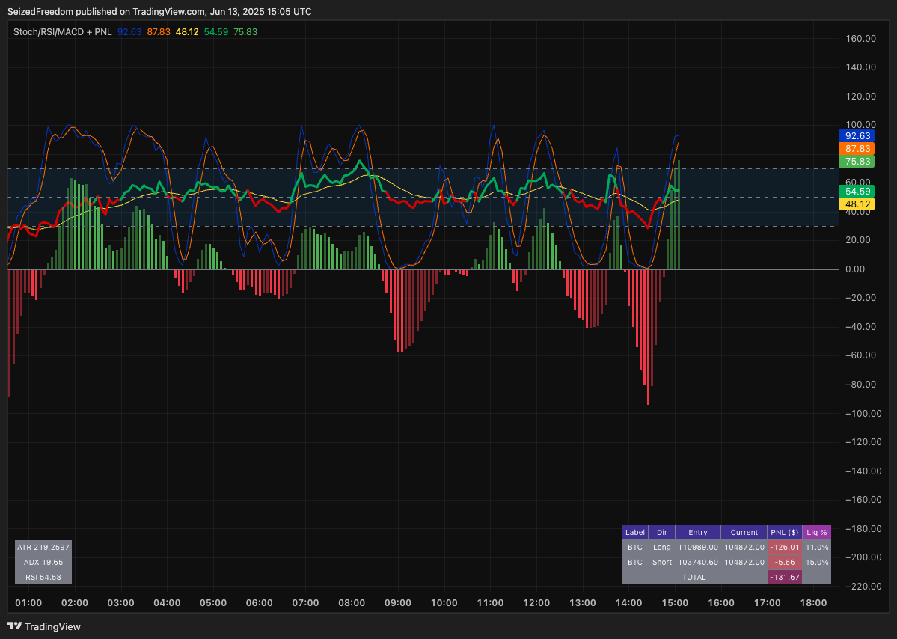

# MEGA Indicator Suite for TradingView by -Tylee-

This repository contains a powerful, all-in-one suite of Pine Script indicators for TradingView, authored by **-Tylee-**. These scripts are designed to work together to provide a complete analysis and trade management dashboard.

The suite consists of two parts:
1.  **Main Chart Overlays:** A selection of comprehensive indicators that run on your main price chart. They all share the same core visual analysis tools but differ in their position tracking capabilities.
2.  **A Companion Oscillator & PNL Tracker:** A feature-rich momentum indicator that runs in the panel below your main chart, combining Stochastic, RSI, a uniquely scaled MACD, and an integrated Mini PNL Tracker.

---

## Part 1: The Main Chart Overlays

There are three versions of the main overlay indicator. All three include the same powerful set of on-chart visual tools: **Bollinger Bands, Ichimoku Cloud, Triple Moving Averages (with crosses), and Auto Fibonacci Levels.**

They differ primarily in how they track and display your PNL.

### The Three Overlay Versions

1.  **`MEGA Multi-Order v4 - FINAL.txt` (Recommended Multi-Trade Tracker)**
    *   The most advanced version for tracking **up to 6 trades simultaneously**.
    *   Features a dedicated PNL table with a **switchable layout (Horizontal or Vertical)** to suit your preference.

2.  **`MEGA Multi Indicator 25.txt` (Legacy Multi-Trade Tracker)**
    *   A slightly older version of the multi-trade tracker. It also tracks **up to 6 trades**.
    *   Functionally identical to v4, but its PNL table is fixed to a **Horizontal layout only**.

3.  **`Multi Indicator 2024.txt` (Simplified Single-Trade Tracker)**
    *   A streamlined version designed for tracking just **one position at a time**.
    *   It merges the PNL information directly into the **Indicator Directions table**, creating a single, compact info panel.

### Layout Examples

**Multi-Order Horizontal Layout** (`v4` and `25`)

**Multi-Order Vertical Layout** (`v4` only)

**Single-Order Integrated Layout** (`2024` only)

---

## Part 2: The Companion Oscillator & PNL Tracker

The file `Stochastic & RSI Combo with Scaled MACD and PNL Tracker.txt` is the final, feature-packed version of the companion indicator. It combines deep momentum analysis with essential PNL tracking in a single, efficient pane.

### Key Features

*   **Momentum Oscillators:**
    *   **Stochastic RSI:** Visualizes the %K and %D lines for identifying short-term overbought/oversold levels.
    *   **Scaled MACD Histogram:** A standard MACD histogram cleverly rescaled to fit within the 0-100 RSI pane, saving screen space.
    *   **Momentum-Sensing Bars:** The MACD histogram bars are **solid** when momentum is decreasing and **hollow** when momentum is increasing, offering an immediate view of momentum shifts.

*   **Integrated Info & PNL Tables:**
    *   **Mini PNL Tracker:** Track up to **3 manual positions** in a compact table. It displays your Label, Direction, Entry, Current Price, PNL ($), and Distance to Liquidation %.
    *   **Info Panel:** A separate small table shows real-time ATR, ADX, and RSI values.
    *   **Master Toggle:** A single checkbox in the settings allows you to **turn all tables on or off** for a completely clean view of the oscillators.

---

## How to Install and Use

1.  **Open TradingView:** Navigate to any chart on [TradingView](https://www.tradingview.com).
2.  **Open Pine Editor:** Click on the "Pine Editor" tab at the bottom of the screen.
3.  **Add the Indicators:**
    *   **For the main overlay:** Choose **one** of the three overlay scripts (`MEGA Multi-Order v4`, `MEGA Multi Indicator 25`, or `Multi Indicator 2024`). Copy its code, paste it into the Pine Editor, and click **"Add to chart"**.
    *   **For the companion oscillator:** In the Pine Editor, click "Open" -> "New indicator". Copy the code from `Stochastic & RSI Combo with Scaled MACD and PNL Tracker.txt`, paste it, and click **"Add to chart"**.
4.  **Configure:** Click the gear icon (⚙️) on each indicator to configure its settings. For the PNL trackers, this is where you will activate and input your trades.

## Credits

*   **Original Author:** All credit for the creation, logic, and implementation of these fantastic indicators goes to **-Tylee-**.
*   **Libraries:** The overlay scripts utilize the `ZigZag` library by `TradingView/ZigZag/7` for their Auto Fibonacci functionality.
